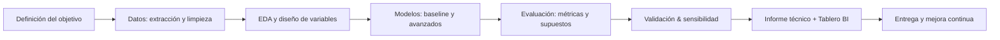

<!-- =============================== -->

<!-- README — Jorge Sarcos (dark elegant) -->

<!-- =============================== -->

<!-- ======= HERO / BANNER (SVG oscuro y elegante) ======= -->

  <svg width="100%" height="240" viewBox="0 0 1200 240" xmlns="http://www.w3.org/2000/svg" role="img" aria-label="Banner de Jorge Sarcos">
    <defs>
      <linearGradient id="g" x1="0" y1="0" x2="1" y2="1">
        <stop offset="0%" stop-color="#0B1220"/>
        <stop offset="50%" stop-color="#111827"/>
        <stop offset="100%" stop-color="#0F172A"/>
      </linearGradient>
      <radialGradient id="pulse" cx="50%" cy="50%" r="70%">
        <stop offset="0%" stop-color="#3B82F6" stop-opacity="0.25"/>
        <stop offset="50%" stop-color="#22D3EE" stop-opacity="0.12"/>
        <stop offset="100%" stop-color="#10B981" stop-opacity="0.06"/>
      </radialGradient>
    </defs>
    <rect width="1200" height="240" fill="url(#g)" rx="28"/>
    <circle cx="250" cy="80" r="160" fill="url(#pulse)"/>
    <circle cx="980" cy="170" r="140" fill="url(#pulse)"/>
    <text x="50%" y="55%" text-anchor="middle" fill="#E5E7EB" font-family="Inter, Segoe UI, Roboto, Arial" font-size="42" font-weight="800" letter-spacing="2">Jorge Sarcos</text>
    <text x="50%" y="75%" text-anchor="middle" fill="#9CA3AF" font-family="Inter, Segoe UI, Roboto, Arial" font-size="18" font-weight="500">· Economista · Científico de Datos · Especialista en Estadística Aplicada</text>
  </svg>

<h1 align="center">Bienvenido a mi espacio en GitHub</h1>

  Combino <b>econometría</b>, <b>estadística aplicada</b> y <b>ciencia de datos</b> para crear soluciones que aportan <b>valor real</b> al sector <b>privado</b> y a la <b>investigación</b> en economía.

  
  
  

---

### ✦ Sobre mí

* Economista (MSc en Estadística Aplicada).
* Experiencia **en el sector privado** (análisis financiero, BI, evaluación de proyectos, forecasting) y **en investigación aplicada** (economía del desarrollo, políticas públicas).
* Publicaciones en **revistas indexadas** sobre **pobreza**, **desigualdad**, **crecimiento económico** y **género**.
* Traducción de datos complejos en **decisiones simples y accionables**.

> Rigor estadístico · claridad narrativa · impacto real.

---

### ✦ En qué destaco

  Econometría · Series de tiempo · Machine Learning · Inferencia Causal · BI con Power BI

<table>
  <tr>
    <td>
      <strong>📈 Econometría</strong> 
      OLS, IV/2SLS, panel (FE/RE), GMM dinámico (Arellano–Bond, Blundell–Bond), PVAR, cointegración.
    </td>
    <td>
      <strong>⏱️ Series de tiempo</strong> 
      SARIMA/ARIMA, VAR/VECM, ARDL, BVAR, Local Projections, choques y respuesta impulso.
    </td>
  </tr>
  <tr>
    <td>
      <strong>🧠 Machine Learning</strong> 
      Árboles, Random Forest, XGBoost, regularización (Lasso/Ridge/Elastic Net), redes básicas, tuning/validación.
    </td>
    <td>
      <strong>🎯 Inferencia causal</strong> 
      DiD, RDD, IV, Synthetic Control, matching, A/B y diseños muestrales.
    </td>
  </tr>
</table>

---

### ✦ Tech Stack

  
  
  
  
  
  
  

  
<b>Detalle de herramientas</b>

* <strong>Python</strong>: numpy, pandas, scikit-learn, statsmodels, pmdarima, prophet, matplotlib/plotly.
* <strong>R</strong>: tidyverse, data.table, forecast, fable, vars, plm, fixest.
* <strong>Stata</strong>: econometría aplicada, panel dinámico, gráficos.
* <strong>SQL</strong>: CTEs, ventanas, modelado de datos, consultas analíticas.
* <strong>Power BI</strong>: DAX, modelado, storytelling con indicadores.
* <strong>Excel</strong>: Power Query, tablas dinámicas, modelos financieros.

---

### ✦ Experiencia (sector privado y aplicado)

* Consultoría: análisis financiero y evaluación de proyectos con modelos econométricos y de forecasting.
* BI & Reporting: tableros ejecutivos en <strong>Power BI</strong> y reportes técnicos con narrativa clara.
* Proyectos de datos: pipelines limpios, control de calidad y versionamiento.

---

### ✦ Investigación

* Economía del desarrollo y <strong>pobreza</strong>.
* <strong>Desigualdad</strong> y movilidad social.
* <strong>Crecimiento económico</strong> y productividad.
* <strong>Género</strong> y mercado laboral.

> Publicaciones en <strong>revistas indexadas</strong>. Ver <a href="https://scholar.google.com/citations?user=XXXXXXXX">Google Scholar</a>.

---

### ✦ Proyectos destacados

  
  
  

---

### ✦ Actividad

  
  

---

### ✦ Método de trabajo

---

### ✦ Casos de uso frecuentes

* Negocios: pronóstico de ventas, segmentación de clientes, pricing y riesgo.
* Sector público/ONG: impacto de políticas, brechas de género, empleo y educación.
* Finanzas: modelos de crédito, stress testing ligero, dashboards gerenciales.

---

### ✦ ¿Hablamos?

Abierto a <strong>consultorías</strong>, <strong>coautorías</strong> y <strong>proyectos</strong>.

**Contacto:** <a href="https://www.linkedin.com/in/jorge-sarcosgon/">LinkedIn</a> · <a href="mailto:jorgesarcos95@gmail.com">[jorgesarcos95@gmail.com](mailto:jorgesarcos95@gmail.com)</a>

---

▁ ▂ ▃ ▄ ▅ ▆ █  <em>Economía · Ciencia de Datos · Estadística · Investigación</em>  █ ▆ ▅ ▄ ▃ ▂ ▁

