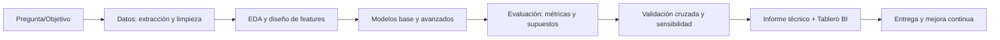

<!-- =============================== -->

<!-- README — Jorge Sarcos (versión premium, elegante y optimizada) -->

<!-- =============================== -->

<!-- ======= HERO / BANNER (SVG elegante, sin hackatón) ======= -->

  <!-- SVG banner: degradé suave + título central -->
  <svg width="100%" height="220" viewBox="0 0 1200 220" xmlns="http://www.w3.org/2000/svg" role="img" aria-label="Banner de Jorge Sarcos">
    <defs>
      <linearGradient id="g" x1="0" y1="0" x2="1" y2="1">
        <stop offset="0%" stop-color="#0ea5e9"/>
        <stop offset="50%" stop-color="#6366f1"/>
        <stop offset="100%" stop-color="#14b8a6"/>
      </linearGradient>
      <linearGradient id="glow" x1="0" y1="0" x2="1" y2="0">
        <stop offset="0%" stop-color="#ffffff" stop-opacity="0.20"/>
        <stop offset="100%" stop-color="#ffffff" stop-opacity="0"/>
      </linearGradient>
    </defs>
    <rect width="1200" height="220" fill="url(#g)" rx="24"/>
    <g opacity="0.2">
      <circle cx="150" cy="180" r="120" fill="#fff"/>
      <circle cx="1050" cy="60" r="90" fill="#fff"/>
    </g>
    <rect x="0" y="0" width="1200" height="220" fill="url(#glow)"/>
    <text x="50%" y="54%" text-anchor="middle" fill="#ffffff" font-family="Segoe UI, Inter, Roboto, Arial" font-size="40" font-weight="800">JORGE SARCOS</text>
    <text x="50%" y="75%" text-anchor="middle" fill="#e5e7eb" font-family="Segoe UI, Inter, Roboto, Arial" font-size="18" font-weight="500">Economista · Científico de Datos · Especialista en Estadística Aplicada</text>
  </svg>

<!-- ======= HEADER ======= -->

<h1 align="center">Bienvenido a mi espacio en GitHub</h1>

  Combino <b>econometría</b>, <b>estadística aplicada</b> y <b>ciencia de datos</b> para crear soluciones que aportan <b>valor real</b> al sector <b>privado</b> y a la <b>investigación</b> en economía.

<!-- Enlaces esenciales (solo los necesarios) -->

---

<!-- ======= PERFIL RESUMEN ======= -->

### 🧭 Sobre mí

* 🎓 Economista (MSc en Estadística Aplicada).
* 💼 Experiencia **en el sector privado** (análisis financiero, BI, evaluación de proyectos, forecasting) y **en investigación aplicada** (economía del desarrollo, políticas públicas).
* 📝 Publicaciones en **revistas indexadas** sobre **pobreza**, **desigualdad**, **crecimiento económico** y **género**.
* 🧩 Me enfoco en traducir datos complejos en **decisiones simples y accionables**.

> *"Rigor estadístico + claridad narrativa = impacto real."*

---

<!-- ======= HIGHLIGHTS (Tarjetas limpias) ======= -->

### ✨ En qué destaco

  <i>Econometría</i> · <i>Series de tiempo</i> · <i>Machine Learning</i> · <i>Inferencia Causal</i> · <i>BI con Power BI</i>

<table>
  <tr>
    <td>
      <h4>📈 Econometría</h4>
      OLS, IV/2SLS, panel (FE/RE), GMM dinámico (Arellano–Bond, Blundell–Bond), PVAR, cointegración.
    </td>
    <td>
      <h4>⏱️ Series de tiempo</h4>
      SARIMA/ARIMA, VAR/VECM, ARDL, BVAR, Local Projections, análisis de choques y respuesta impulso.
    </td>
  </tr>
  <tr>
    <td>
      <h4>🧠 Machine Learning</h4>
      Árboles, Random Forest, XGBoost, regularización (Lasso/Ridge/Elastic Net), redes básicas, tuning y validación.
    </td>
    <td>
      <h4>🎯 Inferencia causal</h4>
      DiD, RDD, IV, Synthetic Control, matching, experimentos A/B y diseños muestrales.
    </td>
  </tr>
</table>

---

<!-- ======= TECH STACK (Badges centrados) ======= -->

### 🛠️ Tech Stack

  
<b>Detalle de herramientas</b>

* **Python:** numpy, pandas, scikit-learn, statsmodels, pmdarima, prophet, matplotlib/plotly.
* **R:** tidyverse, data.table, forecast, fable, vars, plm, fixest.
* **Stata:** econometría aplicada, panel dinámico, gráficos.
* **SQL:** consultas analíticas, CTEs, ventanas, modelado de datos.
* **Power BI:** modelado DAX, relaciones, storytelling con indicadores.
* **Excel:** tablas dinámicas, Power Query, modelos financieros.

---

<!-- ======= EXPERIENCIA / SECTOR PRIVADO ======= -->

### 💼 Experiencia (sector privado y aplicado)

* **Consultoría**: análisis financiero y evaluación de proyectos con modelos econométricos y de forecasting.
* **BI & Reporting**: tableros ejecutivos en **Power BI** y reportes técnicos con narrativas claras.
* **Proyectos de datos**: pipelines limpios, control de calidad y versionamiento.

---

<!-- ======= LÍNEAS DE INVESTIGACIÓN ======= -->

### 🔬 Investigación

* Economía del desarrollo y **pobreza**.
* **Desigualdad** y movilidad social.
* **Crecimiento económico** y productividad.
* **Género** y mercado laboral.

> He publicado artículos en **revistas indexadas** con estos enfoques. Consulta mi **[Google Scholar](https://scholar.google.com/citations?user=XXXXXXXX)**.

---

<!-- ======= PROYECTOS DESTACADOS (Cards limpias) ======= -->

### 🚀 Proyectos destacados

<!-- Agrega más proyectos cuando estén públicos -->

---

<!-- ======= MÉTRICAS GITHUB ======= -->

### 📊 Actividad

  
  

---

<!-- ======= MÉTODO DE TRABAJO (Mermaid) ======= -->

### 🧩 Método de trabajo

---

<!-- ======= CASOS DE USO (bullets claros) ======= -->

### 🧶 Casos de uso frecuentes

* **Negocios**: pronóstico de ventas, segmentación de clientes, pricing y riesgo.
* **Sector público/ONG**: impacto de políticas, brechas de género, empleo y educación.
* **Finanzas**: modelos de crédito, stress testing ligero, dashboards gerenciales.

---

<!-- ======= CONTACTO / CTA ======= -->

### 🤝 ¿Hablamos?

Estoy abierto a **consultorías**, **coautorías** y **proyectos**.
**Escríbeme:** [LinkedIn](https://www.linkedin.com/in/tuusuario) · [Email](mailto:tuemail@gmail.com)

---

<!-- ======= NOTAS DE OPTIMIZACIÓN ======= -->

<!--
Optimización aplicada:
- Enlaces mínimos y esenciales (LinkedIn, Email, Scholar) para reducir ruido.
- SVG banner propio (sin imágenes de terceros), responsive y accesible (aria-label).
- Secciones escaneables, subtítulos consistentes y badges centrados.
- 
 para info avanzada del stack (mejora legibilidad).
- Mermaid para explicar proceso (GitHub lo renderiza nativamente).
- Texto conciso orientado a valor (sector privado + investigación aplicada).
- Emplea emojis sutiles como marcadores visuales (evita sobrecarga cromática).
-->

✨ Economía · Ciencia de Datos · Estadística · Investigación ✨

